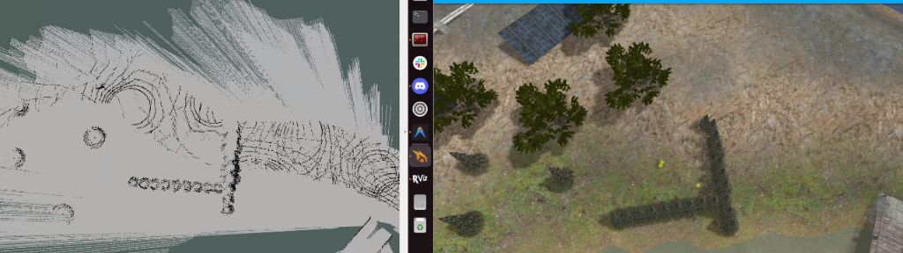

# FASTLIO-Offroad-Sim

## Overview
This repository provides a custom **Clearpath Husky** simulation environment tailored for testing research on **FAST-LIO** in challenging off-road terrains. 

The environment is based on the modern **Clearpath ROS 2 Pipeline**, where we have adapted the latest **Jazzy-based clearpath_simulator** architecture to be fully compatible with **ROS 2 Humble**. This allows us to use the latest simulation features in a stable LTS environment.

### Development Background
- **Environment Base**: Built following the [Official Clearpath ROS 2 Humble Installation Guide](https://docs.clearpathrobotics.com/docs/ros2humble/ros/tutorials/simulator/install/).
- **Pipeline Migration**: While the official pipeline is moving towards ROS 2 Jazzy, we have backported and adapted the [clearpath_simulator (Jazzy branch)](https://github.com/clearpathrobotics/clearpath_simulator) architecture to work seamlessly on **ROS 2 Humble**.
- **Integration**: Combines the robust CPR Husky platform with a Velodyne VLP-16 LiDAR and an IMU to support **FAST-LIO** SLAM.

## Setup
### Prerequisites
- **OS**: Ubuntu 22.04 LTS
- **ROS 2**: Humble (Desktop Install)
- **Simulator**: Gazebo Ignition Fortress

### Installation
1. **Clone and Setup Workspace:**
   ```bash
   mkdir -p ~/your_ws/src
   cd ~/your_ws
   git clone https://github.com/Kangsoonhyuk/FASTLIO-Offroad-Sim.git .
   ```

2. **Import Dependencies & Build:**
   ```bash
   # Import required repositories (Clearpath, Velodyne, FAST-LIO, etc.)
   vcs import src < dependencies.repos
   
   # Install system dependencies (including PCL and ROS packages)
   rosdep install --from-paths src --ignore-src -r -y
   
   # Build the workspace
   colcon build --symlink-install
   
   # Source the setup script
   source install/setup.bash
   ```

## Usage
### Launching the Simulation

- **Scenario 1 (Octomap)**:
  ```bash
  ros2 launch fast_lio fastlio_octomap_sim.launch.py
  ```

- **Scenario 2 (Elevation Mapping)**:
  ```bash
  ros2 launch fast_lio fastlio_elevation_sim.launch.py
  ```

- **Scenario 3 (Groundgrid)**:
  ```bash
  ros2 launch fast_lio fastlio_groundgrid_sim.launch.py
  ```

### Robot Configuration & Teleoperation
This simulation uses a standard **Clearpath Husky A200** equipped with:
- **LiDAR**: Velodyne VLP-16
- **Camera**: Intel RealSense D435

**Note on Teleoperation**: 
All robot topics are namespaced. When using the **Gazebo Teleop plugin**, you **MUST** change the topic from `/cmd_vel` to:
> **/(your_hostname)/cmd_vel**

## Scenarios
This simulation is designed to test main scenarios for off-road navigation:


1. **Octomap (Experiment)**: 
   - We tested using Octomap to generate a 2D grid map from the 3D point cloud.
   - **Result**: As shown below, the generated 2D map is **not smooth and incomplete** in slope environments.
     <br/>
     <br/>
     **Conclusion**: The standard Octomap approach fails to generate a distinct and usable 2D grid map on uneven terrain. Further improvements (e.g., elevation-based filtering or alternative mapping packages) are required to address this issue.
     <br/>

2. **Elevation Mapping (Experiment)**:
   - We tested using `elevation_mapping` to generate a 2.5D elevation map from the point cloud.
   - For more details, please refer to: [Elevation Mapping Details](src/FAST_LIO_ROS2/src/README.md)
   - **Result**: By utilizing 2.5D height information, it distinguishes slopes from obstacles, successfully generating accurate maps even on uneven terrain.
     <br/>

3. **GroundGrid (Experiment)**:
   - We utilized `groundgrid` package which segments ground points from the LiDAR scan to create a traversability map.
   - For more details, please refer to: [GroundGrid Details](src/groundgrid/src/README.md)
   - **Result**: It generates a clean and distinct 2D grid map even on rough off-road terrain, successfully solving the issues seen in Octomap and Elevation Mapping.
     <br/>

## Troubleshooting

- **Error**: FAST-LIO logs `Leaf size is too small` and `Integer indices overflow`, causing immediate failure.
  - **Cause**: **IMU Initialization Failure** due to motion or impact. FAST-LIO assumes the robot is **stationary** for the first few frames (see `IMU_Processing.hpp`) to calculate gravity and bias. If the robot drops (even 0.2cm) during this phase, the massive acceleration spike distorts this calculation, causing the EKF to diverge and the position to shoot to infinity.
  - **Solution**: Ensure the robot is **completely stationary** and the simulation is stable before launching FAST-LIO. Do not launch FAST-LIO while the robot is still settling or moving after spawn.

- **Error**: FAST-LIO logs `Failed to find match for field 'time'.`
  - **Cause**: Gazebo Fortress often optimizes out the `time` field from point cloud data, but FAST-LIO's `Velodyne (2)` mode requires this field for deskewing.
  - **Solution**: Set `preprocess.lidar_type` to **5 (Generic)** to bypass hardware-specific field checks.

- **Error**: FAST-LIO warning `[laser_mapping]: No point, skip this scan!`
  - **Cause**: Transient simulation artifacts (e.g., raycasting hitting sky or NaNs during rapid movement) result in frames with zero valid points after filtering.
  - **Solution**: **Safe to ignore**. This is a common simulation quirk and does not affect mapping if the robot pose continues to update correctly.

<br>
---

## Acknowledgments
This project makes use of the following open-source packages:

- **[Clearpath Robotics](https://github.com/clearpathrobotics)**: Husky platform, simulation environment, and configuration tools.
- **[Velodyne Simulator](https://github.com/ToyToyota/velodyne_simulator)**: Simulation plugins for Velodyne LiDAR.
- **[FAST_LIO](https://github.com/hku-mars/FAST_LIO)**: Fast-LIO2 framework for SLAM.
- **[GroundGrid](https://www.autonomos-labs.de/)**: LiDAR Point Cloud Segmentation and Terrain Estimation by Autonomos-Labs.