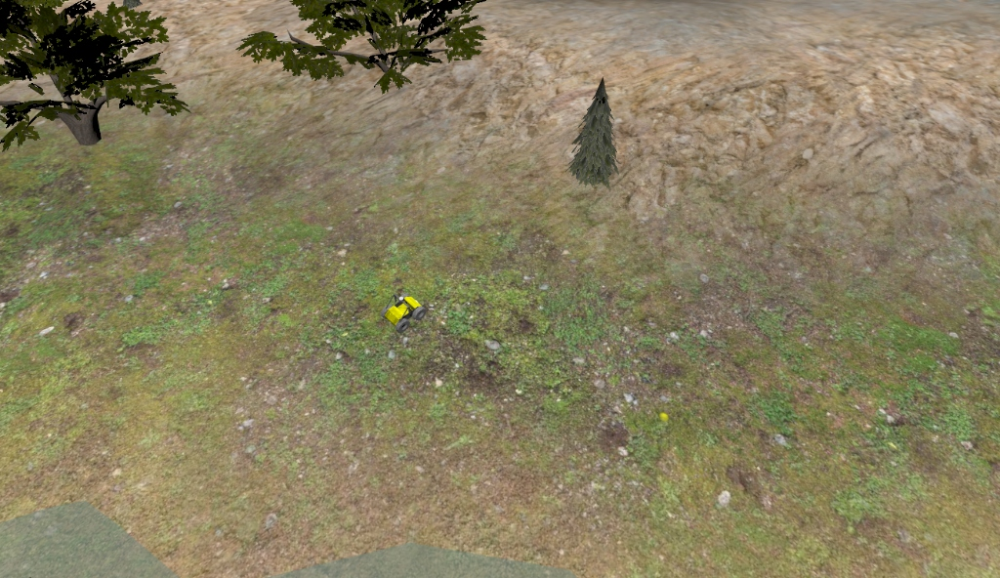
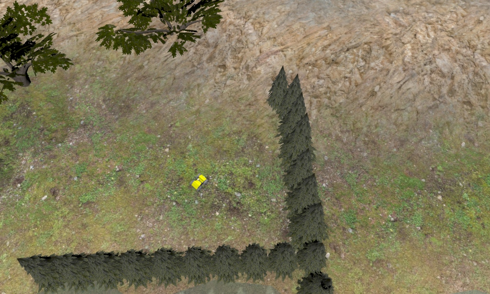

# FASTLIO-Offroad-Sim

## Overview
This repository provides a custom **Clearpath Husky** simulation environment tailored for testing research on **FAST-LIO** in challenging off-road terrains. 

The environment is based on the modern **Clearpath ROS 2 Pipeline**, where we have adapted the latest **Jazzy-based clearpath_simulator** architecture to be fully compatible with **ROS 2 Humble**. This allows us to use the latest simulation features in a stable LTS environment.

### Development Background
- **Environment Base**: Built following the [Official Clearpath ROS 2 Humble Installation Guide](https://docs.clearpathrobotics.com/docs/ros2humble/ros/tutorials/simulator/install/).
- **Pipeline Migration**: While the official pipeline is moving towards ROS 2 Jazzy, we have backported and adapted the [clearpath_simulator (Jazzy branch)](https://github.com/clearpathrobotics/clearpath_simulator) architecture to work seamlessly on **ROS 2 Humble**.
- **Integration**: Combines the robust CPR Husky platform with a Velodyne VLP-16 LiDAR and an IMU to support **FAST-LIO** SLAM.

## Setup
### Prerequisites
- **OS**: Ubuntu 22.04 LTS
- **ROS 2**: Humble (Desktop Install)
- **Simulator**: Gazebo Ignition Fortress

### Installation
1. **Clone and Setup Workspace:**
   ```bash
   mkdir -p ~/clearpath_ws/src
   cd ~/clearpath_ws
   git clone https://github.com/Kangsoonhyuk/FASTLIO-Offroad-Sim.git .
   ```

2. **Import Dependencies & Build:**
   ```bash
   vcs import src < dependencies.repos
   rosdep install --from-paths src --ignore-src -r -y
   colcon build --symlink-install
   source install/setup.bash
   ```

## Usage
### Launching the Simulation
You can choose between the **Test** scenario (with tree rows as obstacles) or the **Baseline** scenario (without row obstacles).

To launch the simulation with the default "pipeline" world:

```bash
ros2 launch setup/launch_sim.launch.py
```

### Robot Configuration & Teleoperation
This simulation uses a standard **Clearpath Husky A200** equipped with:
- **LiDAR**: Velodyne VLP-16
- **Camera**: Intel RealSense D435

**Note on Teleoperation**: 
All robot topics are namespaced. When using the **Gazebo Teleop plugin**, you **MUST** change the topic from `/cmd_vel` to:
> **/(your_hostname)/cmd_vel**

### World Modification
The simulation world is located at `src/clearpath_simulator/clearpath_gz/worlds/pipeline.sdf`.

## Scenarios
This simulation is designed to test three main scenarios for off-road autonomous navigation:

1. **Off-road Autonomous Navigation**: 
   - The Husky robot navigates towards a goal in a rough terrain environment (Inspection World) filled with slopes and dense trees.
     <br/>

2. **Performance Comparison**:
   - **Case 2.1 (Baseline)**: Navigation in an obstacle-free, flat terrain.
     <br/>
   - **Case 2.2 (Test Case)**: Navigation in the "Inspection World" with obstacles (trees) and significant slopes.
     <br/>
   
   The goal is to compare the robustness and efficiency of the navigation stack (FAST-LIO + Nav2) between these conditions.

## Demo Video

## Troubleshooting

### Symptom
FAST-LIO logs "Leaf size is too small" and "Integer indices overflow," causing mapping to fail immediately.

### The Lesson: Calibration & Initialization Stability
The root cause was the **initial robot spawn condition**. Spawning the robot too high above the ground causes it to drop and impact the terrain upon start.

- **The Impact**: This sudden physical jar creates a massive spike in the IMU data at the exact moment FAST-LIO is attempting to initialize its state and extrinsic calibration.
- **The Result**: The "exploding" coordinates are a mathematical side-effect of the EKF diverging due to this initial shock. 
- **The Solution**: **Ensuring the robot is spawned flush with the ground** is critical. A stable, impact-free start ensures a "clean" IMU signal, allowing the filters to converge correctly without the need for external data pre-processing.


### Symptom
FAST-LIO logs "Failed to find match for field 'time'."

### The Lesson: Gazebo Fortress Optimization
Velodyne LiDARs typically provide a `time` field for each point to allow for motion distortion correction. However, **Gazebo Fortress** often optimizes this field out of the simulated point cloud data for performance reasons.

- **The Problem**: If the `lidar_type` in FAST-LIO is set to **2 (Velodyne)**, the algorithm explicitly looks for this `time` field. When it is missing, the driver throws this error.
- **The Solution**: Change the `lidar_type` parameter in your FAST-LIO config (or launch file) to **5 (Generic)**. This tells FAST-LIO to treat the point cloud as a standard generic cloud without expecting specific hardware timestamps.

### Symptom
FAST-LIO logs various warnings: `[laser_mapping]: No point, skip this scan!`

### The Lesson: Simulation Latency & Point Filtering
This warning appears when Fast-LIO receives a point cloud message that is either empty or contains only invalid points (NaN/Inf) after pre-processing.

- **The Cause**: In Gazebo simulation, especially during startup or rapid movement over rough terrain, the simulated LiDAR ray-casting may momentarily fail to return valid returns (e.g., hitting the sky or initialization delay). Fast-LIO filters out these invalid points. If a frame results in 0 valid points, this warning is generated.
- **The Solution**: **Safe to Ignore**. As long as the mapping process continues and the robot pose updates correctly, these are transient warnings caused by the physics engine's calculation quirks.


---

## Acknowledgments
This project makes use of the following open-source packages:

- **[Clearpath Robotics](https://github.com/clearpathrobotics)**: Husky platform, simulation environment, and configuration tools.
- **[Velodyne Simulator](https://github.com/ToyToyota/velodyne_simulator)**: Simulation plugins for Velodyne LiDAR.
- **[FAST_LIO](https://github.com/hku-mars/FAST_LIO)**: Fast-LIO2 framework for SLAM.